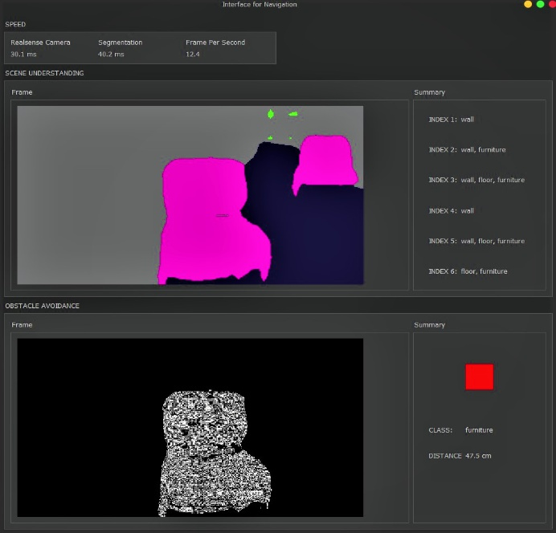

## About
<table>
<tr>
<td>
  
This is a capstone group project of my Master of Data Science degree in The University of Hong Kong. The project is jointly developed by Alex Lau, Guo Huimin and Xie Jun.  

In this capstone project, we developed a deep learning-based local navigation system for the visually impaired users. The system is prototyped in Python and it offers 3 special features:  
1. A state-of-the-art segmentation module that supports **low latency (around 20 FPS) with remarkable segmentation performance**
2. A **scene understanding module** for summarising spatial scene into grid of objects  
3. An **Obstacle avoidance module** for detection of closest obstacle  

 

(Interface Preview)

</td>
</tr>
</table>

## How to Install  
Note that GPU device is needed and librealsense is needed to be install.  

## Pipeline
Our system is composed of several key components: hardware, segmentation module and interface. We use Intel Realsense d435i Camera (attach link) as our hardware and this repository as a base module for our segmentation module. Together with scene understanding module and obstacle avoidance module, we consolidate all components into an interface developed by PyQt5. 

## Segmentation Module  

## Scene Understanding  

## Obstacle Avoidance  

## Demonstration  
As a proof of concept, we tested our system in an indoor scene. We prepared 2 videos for our demonstrations. The first video demonstrates the capacity of the segmentation model on classifying general categories, such as wall, floor, door, furniture and objects. It also shows that our system can trigger alarm when an obstacle is close in our attention.  

[insert gif for brief demon]   

Our second video demonstrates a simple experiment where one of our teammates role played a visually blind user and navigate in a narrow corridor with our system. 

[insert a snapshot of the video]  
[insert google cloud link for long demo]   

## Acknowledgement  
Our segmentation module is mainly built on this repository. The module has provided us a very strong baseline with superior speed. We would also like to thank Professor Yin Guosheng for his generous support and Dr. Luo Ping for his constructive feedbacks on segmentation modules.  

## References  

## License
